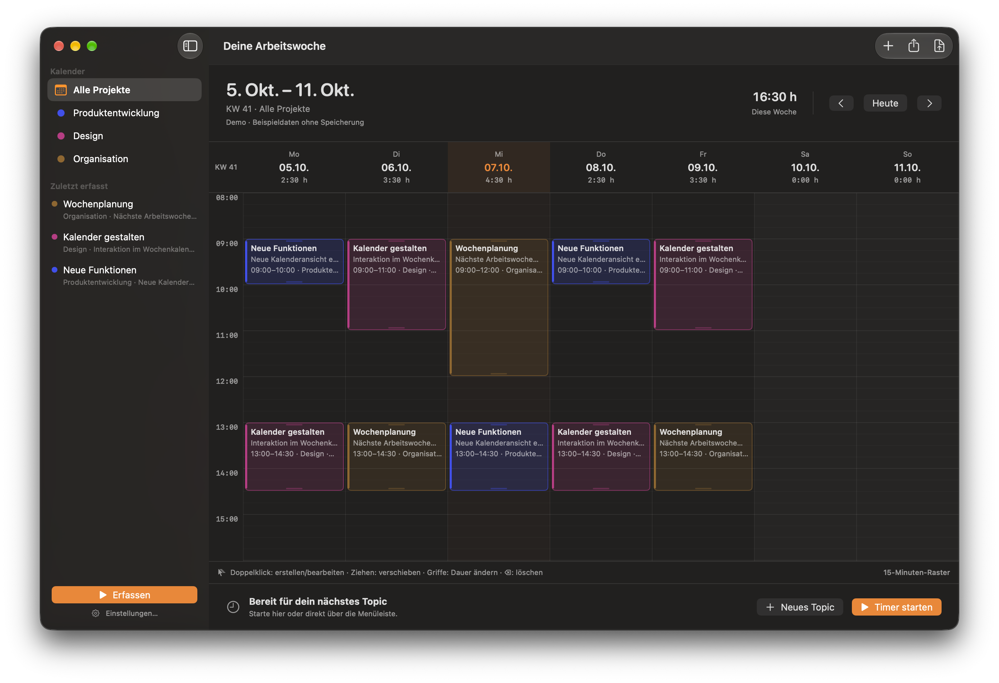
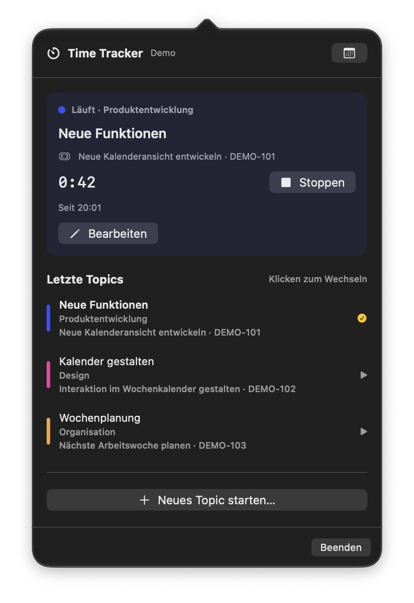

# Time Tracker

A native macOS time tracker with a weekly calendar and quick capture in the menu bar.

## Distribution

Download the latest version from [GitHub Releases](https://github.com/felix-lorenz/timetracker-releases/releases/latest), or install it through [felix-lorenz/homebrew-tap](https://github.com/felix-lorenz/homebrew-tap).

This repository provides product documentation, release notes, distribution archives, and support through GitHub Issues. The source repository is private.

## Features

- Start tracking immediately, with optional booking text, project, and a locally maintained Jira issue.
- Start, switch, and stop timers from the main window or menu bar; discard a running timer after confirmation.
- Review and edit time in a weekly calendar with daily totals, including entries that cross midnight, and edit a running entry's details and start time without stopping it.
- Reuse topics from the newest 100 time entries by start time, deduplicated by exact booking text, project, and local issue. Editing or deleting a record updates this history immediately; no separate topic templates are maintained.
- Preselect the latest booking's optional local issue and its project for new capture, and restore the source entry's assignments when choosing a topic suggestion.
- Start a new topic immediately from the menu bar and edit the running timer in a project-colored card that stays visible above scrollable topic history, with a combined project/issue selector, a date-and-time calendar, and a native Liquid Glass popover background.
- Use a shared project palette with hue-preserving, contrast-adjusted brightness and consistent saturation, plus white menu-bar text and subtle daily progress.
- Manage projects, local issues, and the Tempo Cloud connection in Settings. Local issues can use a label without a Jira key; their project determines the color and filter for assigned bookings. Changing an issue's project updates its existing bookings, including the running timer, while retaining entry IDs, booking text, and time boundaries.
- Search Jira Cloud by exact issue key, title text, or an optional JQL filter, then adopt selected issues locally. Reloading refreshes the Jira key and title while retaining the local label and project; issues from different Jira sites stay separate. Search and local adoption do not create or modify remote Jira tickets.
- Remove an issue's Jira link while retaining its local label, project, and booking assignments.
- Keep tracking records locally, with atomic saves and a backup of the previous valid snapshot.
- Export completed records as a neutral CSV, including the local issue label and an empty Jira key for unlinked issues.
- Preview, export, and transfer worklogs through the optional Tempo Cloud connection, with a local journal to prevent duplicate in-app transfers. Manage the connection in Settings → Tempo Cloud, also accessible from the import dialog.

The current interface is German. Local tracking does not require a Jira connection, Homebrew, or API tokens. Maintaining an issue locally does not create it in Jira.

The neutral CSV is **not a verified Tempo import format**. Tempo Cloud requires the user's own Jira and Tempo credentials and assigns worklogs to that user's account. Every transferred worklog requires exactly one locally maintained issue with a valid Jira link. Bookings without an issue or Jira link remain blocked while valid bookings can be imported. Live Tempo transfer and access permissions remain acceptance checks; development validation uses mocked HTTP and isolated demo data.

Tempo combines completed bookings with the same exact booking text, Jira issue, required attributes, and day in the author's Jira profile time zone. Captured durations are summed before each worklog is rounded to the nearest 15 minutes, with halfway values rounded up and a minimum of 15 minutes. Worklogs transfer their date and duration without the captured start time. Local records remain unchanged.

The resizable Tempo preview groups worklogs into collapsible days and lets you choose individual grouped worklogs with checkboxes. Daily totals follow the current selection, showing captured time and the sum of individually rounded worklog durations without rounding the total again. JSON export and import use that same selection; deselected worklogs are omitted, and both actions are disabled when nothing importable is selected.

If Tempo already contains a worklog for your own account on a day, all new worklogs for that day initially start deselected, regardless of issue or project. A day warning explains this, and additional worklogs can be selected manually. The app checks again before the first transfer; newly occupied days are deselected and the entire run stops before sending or reserving any worklogs, leaving the preview open for review.

Required Tempo work attributes appear as immutable per-ticket preview columns. This version automatically reads a required Tempo Account from the Jira issue and resolves its account key through Tempo. This requires Accounts read access in addition to Worklogs Manage access. Missing or unavailable defaults, including other required attribute types, block the affected bookings while valid groups remain importable. Tempo validates Account applicability during transmission; acceptance in the intended installation remains a live check.

## Screenshots



Time Tracker 0.5.0 — weekly calendar in an isolated demo view.



Time Tracker 0.5.0 — menu bar popover in an isolated demo view.

## Requirements

- macOS 27 (Golden Gate) or later
- Apple Silicon (arm64)
- Homebrew only for installation through the Homebrew cask; direct ZIP installation does not require Homebrew

Distribution builds use Developer ID Application signing, Hardened Runtime, and Apple notarization. Runtime checks on another Mac remain a separate acceptance check.

## Installation and updates

### Direct download

1. Download the ZIP asset from the [latest release](https://github.com/felix-lorenz/timetracker-releases/releases/latest).
2. Extract the archive and move `Time Tracker.app` to `/Applications`.
3. Open Time Tracker from Applications.

To update, quit Time Tracker before replacing the app with the latest download. Quitting preserves an active timer; stop it first if you want tracking to end.

### Homebrew

Install [Homebrew](https://brew.sh), then run:

```sh
brew tap felix-lorenz/tap
brew install --cask felix-lorenz/tap/timetracker
```

To update, quit Time Tracker and run:

```sh
brew update
brew upgrade --cask felix-lorenz/tap/timetracker
```

Quitting does not stop an active timer. Installation and updates preserve local tracking records and the Tempo import journal.

## Data and credentials

Tracking records and the Tempo import journal are stored in `~/Library/Application Support/Time Tracker/`. Jira and Tempo tokens are stored in the macOS login Keychain. Back up the tracking file and import journal together; the journal records transfers that must not be repeated.

Version 0.5.0 upgrades schemas 1–4 in memory to schema 5, which derives topics from entries and stores each local issue's optional Jira link and project. A unique existing project is retained; issues previously used in multiple projects require an explicit choice in Settings before changes can be saved. That choice applies to all bookings assigned to the issue. Entry IDs, booking text, and time boundaries are preserved, and bookings without an issue keep their project. Loading alone leaves the file unchanged; the first successful change or completed conflict resolution saves the upgraded format and backs up the original file. Older app versions cannot read the upgraded tracking file.

Replacing the development build with a Developer ID signed build may require reauthorizing or re-entering the saved connection credentials. Installation and upgrades must preserve tracking records and the import journal.

Jira and Tempo errors are recorded in `Logs/tempo-jira-errors.jsonl` under the data folder, with rotation limited to five files of 1 MiB each. Records contain technical error metadata without tokens, booking or search text, raw URLs, or response bodies. Open the diagnostic folder from Settings → Tempo Cloud; demo logging is disabled.

## Support

Report bugs and request features through [GitHub Issues](https://github.com/felix-lorenz/timetracker-releases/issues). Include the app version, macOS version, steps to reproduce the problem, and relevant error messages. Remove personal work records, Jira details, email addresses, and all tokens from screenshots and logs before sharing them.

Time Tracker is an independent app and is not affiliated with or endorsed by Atlassian, Tempo, or Homebrew.
